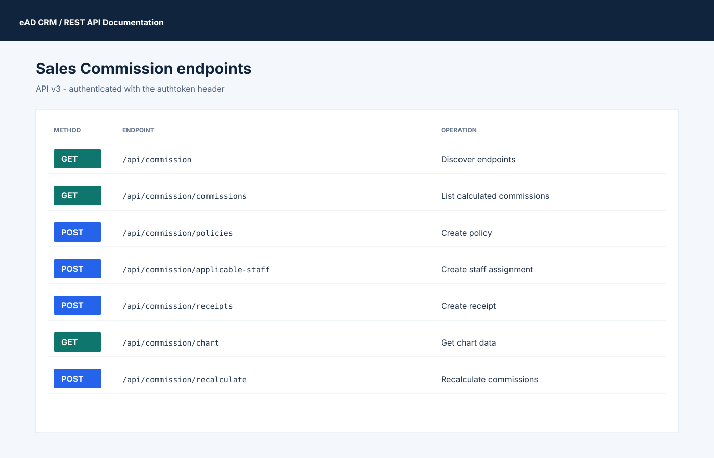
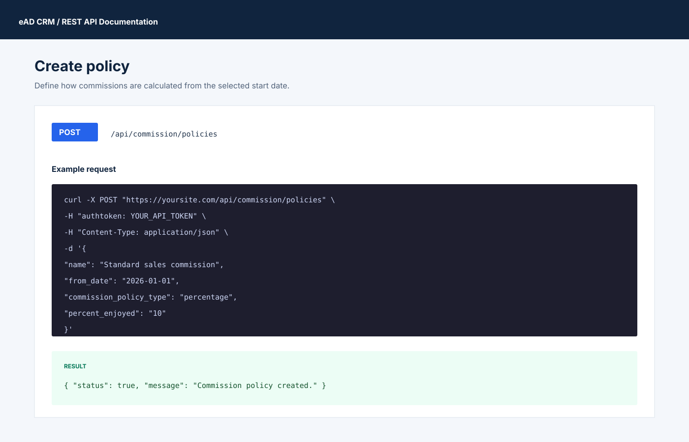
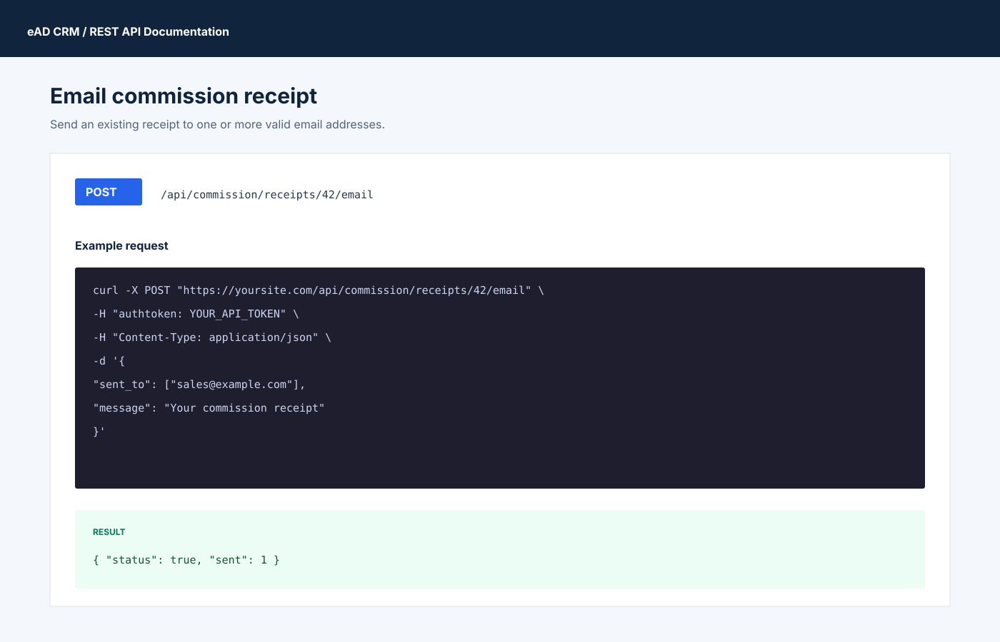

# Sales Commission API

The Sales Commission module is available through API v3 under
`/api/commission`. It covers calculated commissions, commission policies,
policy assignments, reporting hierarchies, receipts, charts, and invoice
recalculation.



## Prerequisites and authentication

1. Install and activate the **Commission** module in Perfex CRM.
2. Give the API user the required **Sales Commission** capability for each HTTP
   method it will use (`GET`, `POST`, `PUT`, and/or `DELETE`).
3. Send the API token in the `authtoken` header on every request.
4. Use `Content-Type: application/json` for requests with a JSON body.

```bash
export BASE_URL="https://your-perfex.example.com"
export TOKEN="YOUR_API_TOKEN"

curl -H "authtoken: $TOKEN" "$BASE_URL/api/commission"
```

The catalog request is a useful first check: it confirms that the module is
active, the route is reachable, and the token has permission to read Sales
Commission data.

## Endpoint summary

| Resource | Supported operations |
| --- | --- |
| `/commission` | Discover the module endpoints |
| `/commission/commissions` | List and retrieve calculated commissions |
| `/commission/policies` | List, create, retrieve, update, and delete policies |
| `/commission/applicable-staff` | Manage staff-to-policy assignments |
| `/commission/applicable-clients` | Manage client-to-policy assignments |
| `/commission/hierarchies` | Manage salesperson/coordinator hierarchies |
| `/commission/salesadmin-groups` | Manage sales-admin/customer-group mappings |
| `/commission/receipts` | List, create, retrieve, update, and delete receipts |
| `/commission/receipts/{id}/pdf` | Download a receipt PDF as Base64 |
| `/commission/receipts/{id}/email` | Email a receipt |
| `/commission/chart` | Retrieve yearly chart data |
| `/commission/recalculate` | Recalculate commissions for selected invoices |

List endpoints use the API's standard pagination fields. Commission lists can
also be filtered by `staffid`, `invoice_id`, `is_client`, and `paid`; receipt
lists can be filtered by `addedfrom`, `paymentmode`, and `convert_expense`.

## Policies

A policy requires `name`, `from_date`, and `commission_policy_type`. Include
the percentage or ladder fields supported by the selected policy type.

```bash
curl -X POST "$BASE_URL/api/commission/policies" \
  -H "authtoken: $TOKEN" \
  -H "Content-Type: application/json" \
  -d '{
    "name": "Standard sales commission",
    "from_date": "2026-01-01",
    "commission_policy_type": "percentage",
    "percent_enjoyed": "10"
  }'
```

Use `PUT /api/commission/policies/{id}` to change a policy and
`DELETE /api/commission/policies/{id}` to remove it.



## Assigning a policy

Staff assignments require a policy ID and at least one staff ID. The same
resource supports reading, updating, and deleting the assignment.

```bash
curl -X POST "$BASE_URL/api/commission/applicable-staff" \
  -H "authtoken: $TOKEN" \
  -H "Content-Type: application/json" \
  -d '{
    "name": "Direct sales team",
    "commission_policy": 2,
    "applicable_staff": [7, 8]
  }'
```

Client policy assignments use `/api/commission/applicable-clients`. Send the
client assignment fields accepted by the Commission module together with the
selected `commission_policy`.

## Hierarchies and sales-admin groups

Create a salesperson/coordinator hierarchy with `salesman`, `coordinator`, and
`percent`:

```bash
curl -X POST "$BASE_URL/api/commission/hierarchies" \
  -H "authtoken: $TOKEN" \
  -H "Content-Type: application/json" \
  -d '{"salesman": 7, "coordinator": 3, "percent": "5"}'
```

Sales-admin mappings use `/api/commission/salesadmin-groups` and the
`salesadmin` and `customer_group` fields.

## Receipts

Creating a receipt requires `amount`, `date`, and a non-empty
`list_commission`. The selected calculated commissions are marked as paid by
the Commission module.

```bash
curl -X POST "$BASE_URL/api/commission/receipts" \
  -H "authtoken: $TOKEN" \
  -H "Content-Type: application/json" \
  -d '{
    "amount": 250,
    "date": "2026-08-13",
    "paymentmode": "1",
    "list_commission": [10, 11],
    "note": "August commissions"
  }'
```

To retrieve the generated receipt document, call
`GET /api/commission/receipts/{id}/pdf`. The response contains the PDF content
encoded as Base64. To email it, post a recipient list and message:

```bash
curl -X POST "$BASE_URL/api/commission/receipts/42/email" \
  -H "authtoken: $TOKEN" \
  -H "Content-Type: application/json" \
  -d '{
    "sent_to": ["sales@example.com"],
    "message": "Your commission receipt"
  }'
```



## Reporting and recalculation

`GET /api/commission/chart` returns yearly commission and paid-commission
series for reporting. To recalculate selected invoices, send their numeric IDs:

```bash
curl -X POST "$BASE_URL/api/commission/recalculate" \
  -H "authtoken: $TOKEN" \
  -H "Content-Type: application/json" \
  -d '{"invoice_ids": [101, 102]}'
```

Recalculation uses the currently configured policies and assignments. Verify
those records before recalculating historical invoices.

## Typical workflow

1. Create the commission policy.
2. Assign it to staff and/or clients.
3. Add optional salesperson/coordinator and sales-admin/customer-group rules.
4. Recalculate the applicable invoices.
5. Review calculated commissions and chart data.
6. Create a receipt for the selected commissions, then download or email it.

## Errors and troubleshooting

| Result | What to check |
| --- | --- |
| `401 Unauthorized` | The `authtoken` header is missing or invalid. |
| `403 Forbidden` | The API user lacks the Sales Commission capability for the HTTP method. |
| `404 Not Found` | The module is inactive, the route/ID is wrong, or the record does not exist. |
| `400 Bad Request` | A required field is missing, an ID list is empty, or the payload is malformed. |

For write failures, first compare the JSON payload with the fields used by the
corresponding Commission module form. Writes are handled by the module model,
so its validation and business rules still apply.
