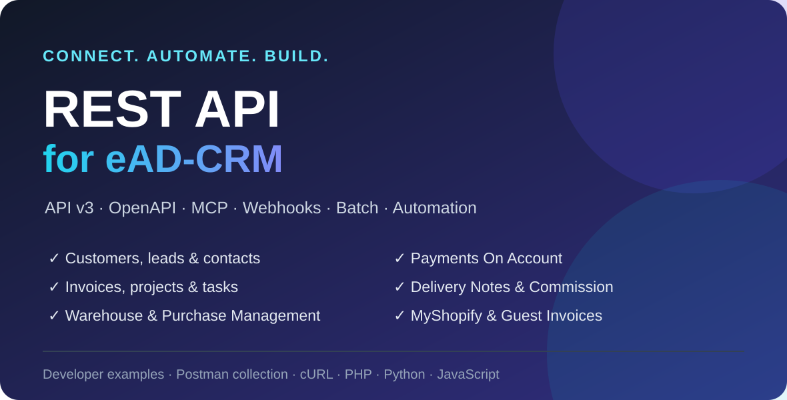

<p>
  <a href="https://www.eadvertise.eu/">
    
  </a>
</p>

# eAD-CRM REST API — דוגמאות, אוסף Postman וקטעי קוד

🌐 [English](README.md) · [Ελληνικά](README.el.md) · **עברית** · [简体中文](README.zh-CN.md) · [Español](README.es.md) · [Português (BR)](README.pt-BR.md) · [Italiano](README.it.md) · [Français](README.fr.md) · [Deutsch](README.de.md) · [Türkçe](README.tr.md) · [Tiếng Việt](README.vi.md) · [ไทย](README.th.md) · [العربية](README.ar.md)

<div dir="rtl">

> **אוסף Postman** מוכן לשימוש, **קטעי קוד** ב-cURL, PHP, Python ו-JavaScript וקטלוג משאבים מלא עבור
> [מודול REST API של eAD-CRM](https://www.eadvertise.eu/) — הדרך המהירה לחבר את eAD-CRM לסוכני AI וליישומי צד שלישי.

[](postman/eadcrm-rest-api.postman_collection.json)
[](openapi/eadcrm-rest-api.openapi.json)
[](LICENSE)
[](https://www.eadvertise.eu/)

**eAD-CRM REST API** מאפשר לקרוא ולכתוב לקוחות, לידים, חשבוניות, הצעות מחיר, פרויקטים, משימות ומשאבים נוספים
באמצעות ממשק HTTP/JSON נקי. הוא מתאים לאינטגרציות CRM, לאוטומציה וליישומים מותאמים אישית. גרסה **v3.0** מוסיפה
**שרת MCP לסוכני AI**, webhooks ברמת production, polling מוכן עבור **Zapier / Make / n8n**, פעולות batch ו-list endpoints חכמים יותר.

- 🧩 **קבלת המודול:** https://www.eadvertise.eu/
- 📖 **מדריך API / תיעוד חי:** https://apidoc.eadcrm.eu/
- 🧾 **מפרט OpenAPI 3.0:** `GET https://yourdomain.com/api/openapi` ([עותק לעיון](openapi/eadcrm-rest-api.openapi.json))

---

## 🚀 מה חדש בגרסה v3.0

| יכולת | Endpoint | תיאור |
| --- | --- | --- |
| 🤖 **שרת MCP** | `POST /api/mcp` | Model Context Protocol ‏(JSON-RPC 2.0) עם **148 כלי CRM מסונני הרשאות** עבור Claude Desktop, ChatGPT, Cursor, n8n AI Agent וכל MCP client |
| 🪝 **Webhooks 2.0** | `/api/webhooks` | **124 אירועים**, ניהול REST, שליחה אסינכרונית עם retries, הגנת SSRF ובקשות חתומות ב-**HMAC** |
| 🔌 **אוטומציה (polling)** | `/api/zapier/*` | polling triggers מוכנים עבור **Zapier, Make.com, n8n** וכל כלי מבוסס polling |
| ⚡ **Batch** | `POST /api/batch` | עד **50 פעולות** בבקשה אחת |
| 📚 **מאגר ידע** | `/api/knowledge_base` | CRUD של מאמרים וקבוצות |
| 🗒️ **הערות** | `/api/notes` | הערות פולימורפיות עבור 12 סוגי ישויות |
| 📄 **רשימות חכמות** | כל list endpoint | פרמטרים אופציונליים `?page=&per_page=`, `?fields=`, `?sort=`, `?created_after=&created_before=` |
| 🛡️ **כתיבה בטוחה** | כל `POST` | `Idempotency-Key`, התעלמות משדות לא מוכרים ב-`PUT` וכותרות `X-RateLimit-*` |
| 📐 **OpenAPI 3.0** | `GET /api/openapi` | כל שטח ה-API במסמך machine-readable אחד — **256 paths, 510 operations** |

> כל היכולות החדשות הן **אופציונליות** ותואמות לאחור. ללא הפרמטרים החדשים, התגובות נשארות זהות לגרסאות הקודמות.

---

## תוכן המאגר

| תיקייה | תוכן |
| --- | --- |
| [`postman/`](postman/) | **אוסף** ו-**environment** של Postman עם `{{base_url}}` ו-`{{authtoken}}` |
| [`snippets/curl/`](snippets/curl/) | פקודות `curl` מוכנות להעתקה |
| [`snippets/php/`](snippets/php/) | דוגמאות PHP באמצעות cURL |
| [`snippets/python/`](snippets/python/) | דוגמאות Python באמצעות `requests` |
| [`snippets/javascript/`](snippets/javascript/) | דוגמאות JavaScript / Node באמצעות `fetch` |
| [`docs/`](docs/) | אימות, pagination, filtering, webhooks, MCP, אוטומציה, custom tables ושגיאות |

בכל שפה יש דוגמאות עבור **לקוחות, חשבוניות ולידים**, תכונות v3 כגון **webhooks, MCP, batch, automation,
knowledge base, notes ומודולים אופציונליים**, וכן קובץ `list_features` עבור pagination, בחירת שדות ומיון.

---

## התחלה מהירה

כל בקשה מאומתת באמצעות הכותרת **`Authtoken`**. צרו token בממשק הניהול של eAD-CRM תחת
**API → API Management**, ולאחר מכן פנו אל `https://yourdomain.com/api/...`:

```bash
curl -H "authtoken: YOUR_API_TOKEN" https://yourdomain.com/api/customers
```

התגובה היא רשימת הלקוחות בפורמט JSON. מידע נוסף נמצא ב-[`docs/authentication.md`](docs/authentication.md)
ובדוגמאות שבתיקיית [`snippets/`](snippets/).

### שימוש באוסף Postman

1. ב-Postman בחרו **Import** וייבאו את [`postman/eadcrm-rest-api.postman_collection.json`](postman/eadcrm-rest-api.postman_collection.json).
2. ייבאו את ה-environment מתוך [`postman/eadcrm-rest-api.postman_environment.json`](postman/eadcrm-rest-api.postman_environment.json).
3. הגדירו את `base_url` כ-`https://yourdomain.com/api` ואת `authtoken` כ-token שלכם.
4. בחרו request ולחצו **Send**.

### חיבור סוכן AI באמצעות MCP

חברו כל MCP client, כגון Claude Desktop, Cursor, ChatGPT או n8n AI Agent, אל
`POST https://yourdomain.com/api/mcp` ושלחו את הכותרת `authtoken`. ראו
[`docs/mcp.md`](docs/mcp.md) ו-[`snippets/curl/mcp.sh`](snippets/curl/mcp.sh).

---

## קטלוג endpoints

כל endpoints מסוג CRUD פועלים לפי מוסכמת REST: ‏`GET` לרשימה, `GET /:id` לרשומה אחת,
`POST` ליצירה, `PUT /:id` לעדכון ו-`DELETE /:id` למחיקה.

### משאבי CRM מרכזיים

| משאב | Base path | פעולות נפוצות |
| --- | --- | --- |
| לקוחות | `/api/customers` | list, get, create, update, delete |
| אנשי קשר | `/api/contacts` | list, get, create, update, delete |
| לידים | `/api/leads` | list, get, create, update, delete |
| חשבוניות | `/api/invoices` | list, get, create, update, delete |
| הצעות מחיר | `/api/estimates` | list, get, create, update, delete |
| תעודות זיכוי | `/api/credit_notes` | list, get, create, update |
| תשלומים | `/api/payments` | list, get, create |
| הצעות | `/api/proposals` | list, get, create, update, delete |
| חוזים | `/api/contracts` | list, get, create, update, delete |
| פרויקטים | `/api/projects` | list, get, create, update, delete |
| משימות | `/api/tasks` | list, get, create, update, delete |
| אבני דרך | `/api/milestones` | list, get, create, update, delete |
| דוחות זמן | `/api/timesheets` | list, get, create, update, delete |
| מנויים | `/api/subscriptions` | list, get, create, update |
| פריטים | `/api/items` | list, get, create, update, delete |
| הוצאות | `/api/expenses` | list, get, create, update, delete |
| צוות | `/api/staffs` | list, get, create, update, delete |
| לוח שנה | `/api/calendar` | list, get, create, update, delete |
| שדות מותאמים | `/api/custom_fields` | רשימה לפי related type |
| Common lookups | `/api/common` | מדינות, מסים, מטבעות, statuses ועוד |

### פלטפורמת v3 ומשאבים נוספים

| משאב | Base path | פעולות נפוצות |
| --- | --- | --- |
| **שרת MCP** | `/api/mcp` | `POST` JSON-RPC 2.0: `initialize`, `tools/list`, `tools/call` |
| **Batch** | `/api/batch` | `POST` של עד 50 פעולות |
| **Webhooks** | `/api/webhooks` | list, get, create, update, delete, toggle, events ו-logs |
| **Automation** | `/api/zapier` | resources, polling ו-test endpoints |
| **Knowledge Base** | `/api/knowledge_base` | CRUD של מאמרים וקבוצות |
| **Notes** | `/api/notes` | list, get, create, update, delete |
| **Warehouse** | `/api/warehouse` | מלאי, קבלות, משלוחים, העברות והתאמות |
| **Payments On Account** | `/api/paymentsonaccount` | קבלות, הקצאות, statements, PDF ודוא״ל |
| **Delivery Notes** | `/api/delivery_notes` | CRUD, statuses, PDF, דוא״ל והמרות מסמכים |
| **Sales Commission** | `/api/commission` | policies, assignments, receipts, chart ו-recalculation |
| **MyShopify** | `/api/myshopify` | נתונים מיובאים, mappings, logs וסנכרון |
| **Purchase Management** | `/api/purchase` | ספקים, מסמכי רכש, תשלומים ו-statements |
| **Guest Invoices** | `/api/guest_invoices` | יצירת guest invoice ו-checkout |

השדות המדויקים של כל request מתועדים ב-[**מדריך ה-API הרשמי**](https://apidoc.eadcrm.eu/).
עבור payloads של מודולים אופציונליים ראו [`docs/modules.md`](docs/modules.md).

---

## Pagination וסינון ב-v3

כל list endpoint מקבל פרמטרים אופציונליים. בשימוש בהם מתקבלת מעטפת `{ data, meta }`;
ללא הפרמטרים מתקבל ה-legacy array.

```bash
curl -H "authtoken: YOUR_API_TOKEN" \
  "https://yourdomain.com/api/customers?page=2&per_page=20&fields=id,company&sort=-datecreated&created_after=2026-01-01"
```

| פרמטר | דוגמה | תוצאה |
| --- | --- | --- |
| `page`, `per_page` | `?page=2&per_page=20` | Pagination עם `{ data, meta }` |
| `fields` | `?fields=id,company` | החזרת השדות שנבחרו בלבד |
| `sort` | `?sort=-datecreated,company` | מיון, כאשר `-` מציין סדר יורד |
| `created_after`, `created_before` | `?created_after=2026-01-01` | סינון לפי תאריך |

הפרמטר `per_page` מקבל ערכים 1–100, וברירת המחדל היא 25. ראו
[`docs/pagination-filtering.md`](docs/pagination-filtering.md).

---

## שדרוג מגרסה 2.x

**אין breaking changes.** יכולות הרשימה החדשות הן opt-in:

- ללא `page` או `per_page` מוחזר אותו plain array של גרסה 2.x.
- אף endpoint לא שינה שם.
- שדות לא מוכרים ב-`PUT` נזנחים במקום לגרום לשגיאה.
- בקשות `POST` מקבלות כותרת אופציונלית `Idempotency-Key` לביצוע retries בטוחים.
- יש להפעיל את שורות ההרשאה החדשות ב-API tokens קיימים.

---

## אינטגרציות ושימושים נפוצים

- **עוזרי AI באמצעות MCP** — Claude, ChatGPT או Cursor יכולים לקרוא ולעדכן את ה-CRM.
- **Zapier / Make / n8n** — אוטומציה ללא קוד באמצעות polling triggers.
- **Webhooks** — שליחת אירועי eAD-CRM ל-Slack, ל-Discord או ל-backend מותאם, עם חתימת HMAC.
- **Google Sheets / Power Automate** — סנכרון לקוחות, חשבוניות ותשלומים.
- **יישומים ופורטלים מותאמים** — בניית יישום mobile או customer portal.
- **הנהלת חשבונות ו-e-commerce** — סנכרון חשבוניות ופריטים עם מערכות חיצוניות.

---

## אימות

| שיטה | שימוש |
| --- | --- |
| Header (מומלץ) | `Authtoken: YOUR_API_TOKEN` |
| Query parameter | `?authtoken=YOUR_API_TOKEN` |

API tokens נוצרים ומקבלים הרשאות תחת **API → API Management**. פרטים נוספים נמצאים ב-
[`docs/authentication.md`](docs/authentication.md).

---

## שאלות נפוצות

**האם ל-eAD-CRM יש REST API?**  
כן. [REST API עבור eAD-CRM](https://www.eadvertise.eu/) מוסיף API מלא מבוסס HTTP/JSON למשאבי ה-CRM,
וכן שרת MCP, webhooks, batch ו-automation endpoints.

**האם אפשר לחבר את eAD-CRM ל-ChatGPT, ל-Claude או לסוכני AI אחרים?**  
כן. גרסה v3 כוללת שרת MCP ב-`POST /api/mcp`, עם כלים המסוננים לפי הרשאות.

**כיצד מתבצע האימות?**  
שלחו את ה-API token בכותרת HTTP בשם `Authtoken`, או כ-query parameter בשם `?authtoken=`.

**מהו ה-base URL?**  
`https://yourdomain.com/api`, לדוגמה `https://yourdomain.com/api/customers`.

**האם קיים אוסף Postman?**  
כן. ייבאו את [`postman/eadcrm-rest-api.postman_collection.json`](postman/eadcrm-rest-api.postman_collection.json)
ואת קובץ ה-environment המצורף.

---

## מידע ותמיכה


מאגר זה מלווה את המודול המסחרי:

> **[REST API עבור eAD-CRM — חיבור eAD-CRM ליישומי צד שלישי](https://www.eadvertise.eu/)**
> מאת [eAdvertise](https://www.eadvertise.eu/).

- 🛒 **רכישה ומידע נוסף:** https://www.eadvertise.eu/
- 📖 **תיעוד:** https://apidoc.eadcrm.eu/
- 💬 **תמיכה:** https://www.eadvertise.eu/

תרומות של דוגמאות נוספות יתקבלו בברכה — ראו [`CONTRIBUTING.md`](CONTRIBUTING.md).

## רישיון

קוד הדוגמאות במאגר מופץ תחת [רישיון MIT](LICENSE). ‏"eAD-CRM" הוא סימן מסחרי של בעליו,
ומודול ה-REST API הוא מוצר מסחרי של eAdvertise.

</div>
